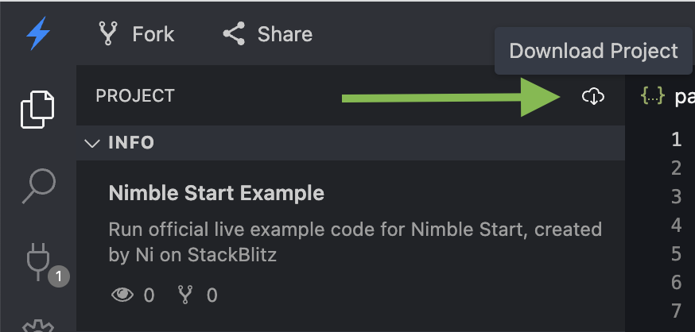

# Nimble Typescript Getting Started

This example project creates a simple counter application using Vanilla (no framework) Typescript and the Nimble Design System.

## Prerequisites

1. Install VSCode  (or your editor of choice) - <https://code.visualstudio.com/>  

    VSCode is a free editor (borderline IDE) that is very popular in web development.

2. Install Node.js - <https://nodejs.org/en/download/>  

    Node.js is an open-source, cross-platform, JavaScript runtime environment that executes JavaScript code outside of a web browser.

## Start

Start Example:

[](https://stackblitz.com/github/ni/nimble/tree/typescript-example/examples/nimble-typescript/start)

Use the Stackblitz link to launch the starting point of the example. You can download the example as a zip file, extract it, and open it in your local editor.



Open the project folder in your editor and run `npm install` to install all the dependencies needed to run the project.

Run `npm run dev` to run the development version of the application and see it in your web browser.

## Integrating Nimble

1. Add the nimble components to your project dependencies.  
`npm install @ni/nimble-components`
1. In `counter.ts` import the nimble-button reference and update the parameter type to `Button` for the `setupCounter` function.  

    ```ts
    import { Button } from '@ni/nimble-components/dist/esm/button';

    export function setupCounter(element: Button) {
    let counter = 0;

    const setCounter = (count: number) => {
        counter = count;
        element.innerHTML = `count is ${counter}`;
    };
    element.addEventListener('click', () => setCounter(counter + 1));
    setCounter(0);
    }
    ```

1. Add the appropriate imports to the beginning of `main.ts`.  

    ```ts
    import '@ni/nimble-components/dist/esm/button';

    import { Button } from '@ni/nimble-components/dist/esm/button';
    ```

1. Also in `main.ts`, update the Type for the querySelector to `Button`.  

    ```ts
    setupCounter(document.querySelector<Button>('#counter')!)
    ```

1. Update `style.scss` with the nimble tokens and fonts.  

    ```css
    @import '@ni/nimble-components/dist/tokens.scss';
    @import '@ni/nimble-tokens/dist/fonts/css/fonts.css';

    :root {
    color: $ni-nimble-headline-font-color;
    }

    body {
    margin: 0;
    display: flex;
    place-items: center;
    min-width: 320px;
    min-height: 100vh;
    background-color: $ni-nimble-application-background-color;
    }

    h1 {
    font: $ni-nimble-group-header-font;
    font-size: 3.2em;
    }

    #app {
    max-width: 1280px;
    margin: 0 auto;
    padding: 2rem;
    text-align: center;
    }
    ```

1. Update `index.html` to use a `nimble-button` instead of a standard HTML `button`.  

    ```html
    <body>
        <div id="app">
        <h1>Nimble Counter</h1>
        <div>
            <nimble-button id="counter"></nimble-button>
        </div>
        </div>
    </body>
    ```

1. Re-run the application.

    You can see now that the application is now using typography, styles and controls from the Nimble Design System.

## Finish

See the Finished Example, for reference:

[](https://stackblitz.com/github/ni/nimble/tree/typescript-example/examples/nimble-typescript/finish)
